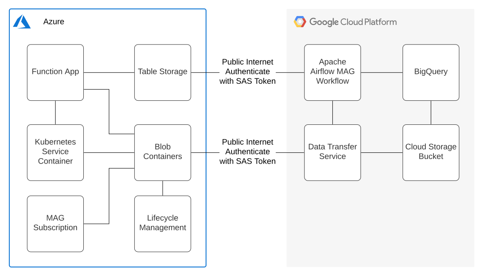
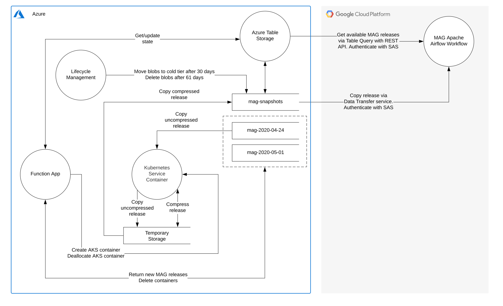

# MAG Archiver
MAG Archiver is an Azure Function App that automatically archives Microsoft Academic Graph (MAG) releases so that they 
can be transferred to other cloud services.

## Setup
The following instructions explain how to setup Mag Archiver.

### Dependencies
* [Install Azure CLI](https://docs.microsoft.com/en-us/cli/azure/install-azure-cli?view=azure-cli-latest)
* [Install Azure Functions Core Tools](https://docs.microsoft.com/en-us/azure/azure-functions/functions-run-local?tabs=linux%2Ccsharp%2Cbash)
* [Create an Azure Storage Account](https://docs.microsoft.com/en-us/azure/storage/common/storage-account-create?tabs=azure-portal)
  * Region: westus (a low latency US region from Australia and NZ).
  * Access tier: hot (need to be able to delete containers without cold storage deletion fees)
  * Create container: mag-snapshots
  * Under Blob Service > Lifecycle Management > Code view: add the life-cycle rules from lifecycle-rules.json
    * These rules move blobs to the cold tier after 30 days and delete the blobs after 61 days.
* [Create an Azure Function App](https://docs.microsoft.com/en-us/azure/azure-functions/functions-create-function-app-portal)
  * Take note of your function app name, you will need it later.
  * Under Settings > Configuration > Application settings, add the following Application settings (name: value):
    * STORAGE_ACCOUNT_NAME: the name of your storage account.
    * STORAGE_ACCOUNT_KEY: they key for your storage account.
    * TARGET_CONTAINER: mag-snapshots
* [Subscribe to Microsoft Academic Graph on Azure storage](https://docs.microsoft.com/en-us/academic-services/graph/get-started-setup-provisioning) 

### Deploy to Azure
To deploy mag-archiver follow the instructions below.

#### Setup Azure account
Make sure that the Azure account that your Function App is deployed to is set as the default.

To do this, list your accounts and copy the id of the account that should be the default account:
```bash
az account list
```

Set the account to the Azure account that your Function App is deployed to:
```bash
az account set -s <insert your account id here>
```

Check that the correct account is set, you should see your account show up:
```bash
az account show
```

#### Deploy the Function App
Clone the project:
```bash
git clone git@github.com:The-Academic-Observatory/mag-archiver.git
```

Enter the function app folder:
```bash
cd mag-archiver
```

Deploy the function:
```bash
func azure functionapp publish <your function app name>
```

## Architecture
The architecture of MAG Archiver is illustrated via the deployment and process view diagrams below.

### Deployment View


### Process View
